# Báo cáo Quarier


## Thu thập thông tin


### Quét Nmap


Đầu tiên, chúng ta cần thu thập thông tin về mục tiêu. Sử dụng công cụ Nmap để quét các cổng mở và phiên bản dịch vụ. Trong môi trường thực tế, cần áp dụng các biện pháp giảm noise cho Nmap như sử dụng các tùy chọn `-sS -Pn -T1`. Tuy nhiên, trong môi trường lab HTB, chúng ta có thể sử dụng lệnh quét full để thu thập nhiều thông tin hơn.

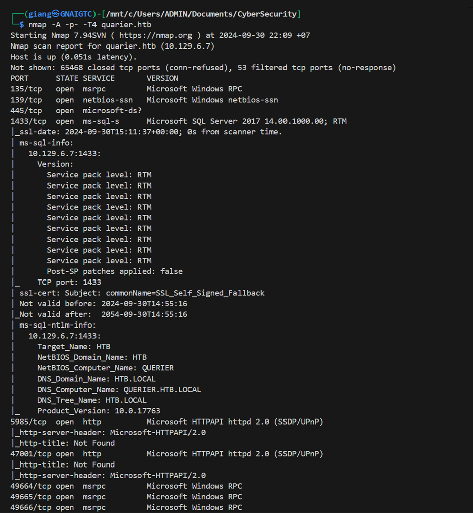
Kết quả quét Nmap cho thấy các thông tin quan trọng sau:


**Thông tin về tên miền:**

- NetBIOS Domain: HTB
- DNS Domain: HTB.LOCAL  
- Computer Name: QUERIER
- Product Version: 10.0.17763 (Windows Server 2019)

**Thông tin về dịch vụ:**

- SMB/NetBIOS (139/445)
  - Có thể thực hiện liệt kê shares và users
  - Kiểm tra null session và anonymous access
  - Thử nghiệm relay attacks
- MSSQL Server (1433)
  - Thử nghiệm SQL injection
  - Thử nghiệm với Default/weak credentials
- Microsoft HTTPAPI (5985/47001)
  - Kích hoạt quản lý từ xa
  - Potential Credential spray attacks
- RPC (135 + các port lớn khác)
  - Có thể liệt kê users và services

## Chiến lược tấn công


**Mức độ ưu tiên cao:**

- SMB Enumeration:
  - Liệt kê shares
  - Tìm kiếm sensitive files
  - Kiểm tra quyền ghi file
- MSSQL Attack Chain:
  - Bruteforce sa account
  - Tìm kiếm stored credentials

**Mức độ ưu tiên trung bình:**

- WinRM Exploitation:
  - Password spraying với gathered usernames
  - Khai thác nếu có valid credentials
- RPC Enumeration:
  - User enumeration
  - Service discovery
  - Policy information gathering

## Liệt kê SMB

Anonymous login và null sessions

Sử dụng `smbclient` để liệt kê các tài nguyên trên SMB server. Thu được kết quả:
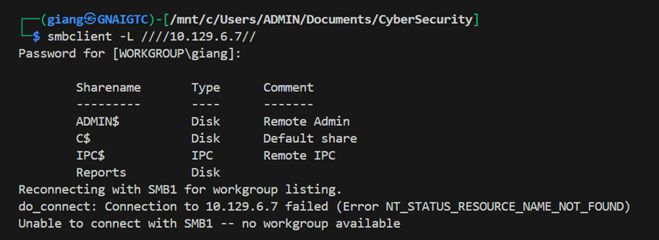
**Chia sẻ ADMIN$ và C$:** Biến $ cho thấy đây là các Folder ẩn.

**Chia sẻ IPC$:** Chia sẻ này ít hấp dẫn hơn từ góc độ tấn công, nhưng nó có thể được sử dụng để khai thác các lỗ hổng trong giao thức SMB hoặc thực hiện các cuộc tấn công relay.

**Chia sẻ Reports:** Đây là một chia sẻ tùy chỉnh có thể chứa dữ liệu quan trọng hoặc nhạy cảm. Khai thác chia sẻ này có thể cung cấp thông tin hữu ích hoặc các tệp tin có thể bị lạm dụng.

Thử tiến hành truy cập, ta thấy chỉ có quyền truy cập vào thư mục Report. Sau khi phân tích sâu hơn các thông tin public, phát hiện file "Currency Volume Report.xlsm". Tải file này về để phân tích chi tiết.
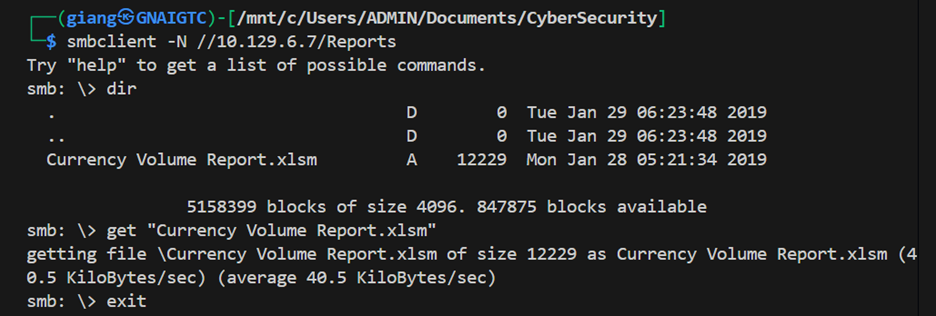

File có định dạng xlsm (Excel Macro-Enabled Workbook) - một định dạng bảng tính của Microsoft Excel hỗ trợ macro. Macro là các đoạn mã VBA (Visual Basic for Applications) giúp tự động hóa các tác vụ trong Excel.


Sử dụng binwalk để phân tích file Currency Volume Report.xlsm, phát hiện đây là file nén ZIP chứa nhiều file XML và file vbaProject.bin.
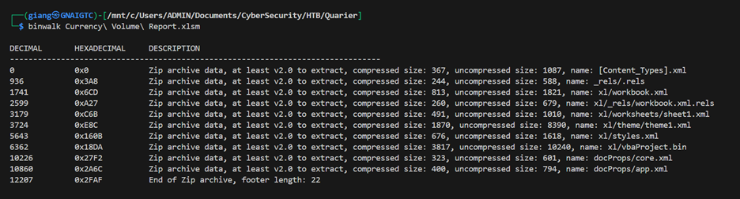

Giải nén file để lấy tất cả các file con, sau đó tìm kiếm thông tin xác thực. Phát hiện credential trong file vbaProject.bin:
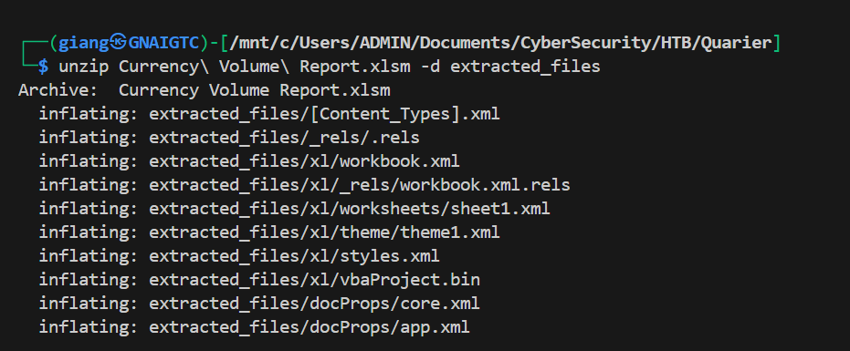

Sau khi đọc tất cả các file của Currency Volume Report.xlsm phát hiện credential trong file vbaProject.bin 
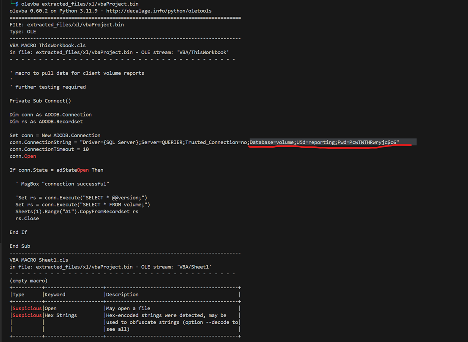

**Tổng kết:**
Ta đã thu được thông tin về kết nối đến cơ sở dữ liệu MSSQL và thông tin xác thực. Điều này cho phép chúng ta thực hiện các cuộc tấn công. Tạm dừng việc phân tích các hướng đi khác và tập trung vào vị trí này.
```
conn.ConnectionString = "Driver={SQL Server};Server=QUERIER;Trusted_Connection=no;Database=volume;Uid=reporting;Pwd=PcwTWTHRwryjc$c6"
```


## Truy cập ban đầu

### MSSQL

Lấy thông tin đã thu được từ bước recon để thử đăng nhập vào server MSSQL, ta sử dụng mssqlclient.py và sử dụng option windows-auth để xác định loại đăng nhập. Kết quả thu được đăng nhập thành công.
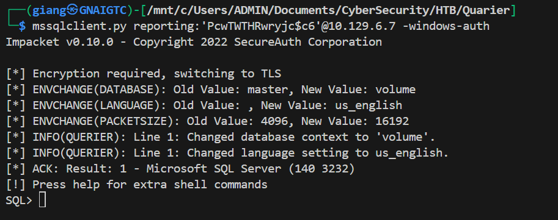

### Liệt kê

Sau khi xác định được đã truy cập được vào database, ta cần xác định những quyền mình đang có.
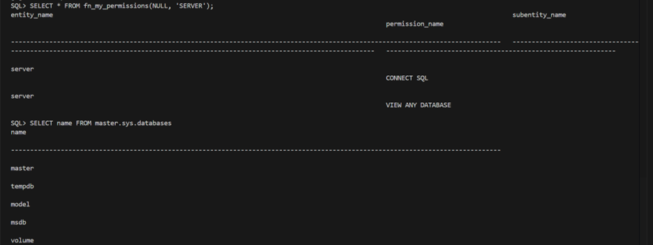
Phân tích kết quả nhận thấy tài khoản reporting có 2 quyền là quyền connect SQL và quyền view any database. Trong đó quyền view any database sẽ giúp ích cho việc khai thác thông tin tại cơ sở dữ liệu, lúc này ta sẽ thực hiện lấy thông tin về tên và thuộc tính của tất cả cơ sở dữ liệu hiện có trên server.
Ta sẽ thực hiện liệt kê tất cả các databases trong server. 

Trong số các cơ sở dữ liệu (CSDL) trên chỉ có volume là CSDL do người dùng tạo ra vì vậy ta sẽ tập trung vào khai thác CSDL này.
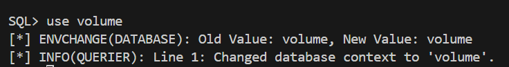
Thực hiện truy vấn tất cả các đối tượng trong cơ sở dữ liệu volume có kiểu là 'U' - mục đích tìm kiếm thông tin về user trong CSDL. Kết quả không tìm thấy tables nào => lập luận không tìm thấy thông tin người dung trong CSDL này.
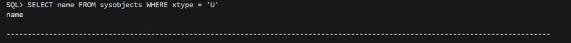
Tới đây, thứ chúng ta cần là tạo được 1 shell thực thi các lệnh command line tại server mục tiêu. Đối với hệ quản trị CSDL như MSSQL thì có câu truy vấn là xp_cmdshell sẽ giúp ta làm việc này. Tuy nhiên thử thì có thông báo thất bại do người dùng không có quyền.

Chuyển hướng sang tìm cách leo quyền để đặt shell vào server mục tiêu. Suy luận dựa trên các thông tin đã có và tìm hiểu về MSSQL trên internet ta có lập luận sau:

- SQL Server và UNC Paths: SQL Server có khả năng truy cập các đường dẫn UNC (Universal Naming Convention). Điều này có thể bị khai thác để lừa SQL Server gửi thông tin xác thực đến một máy chủ SMB giả mạo.
- Tài khoản dịch vụ: MSSQL thường chạy dưới một tài khoản dịch vụ có quyền cao hơn. Nếu chúng ta có thể lấy được hash của tài khoản này, có thể sử dụng nó để thực hiện các cuộc tấn công Pass-the-Hash hoặc các kỹ thuật khác để leo thang đặc quyền.


## Leo thang đặc quyền

### Leo thang đặc quyền trong MSSQL

Sử dụng công cụ Responder để tạo ra 1 server đang chia sẻ dịch vụ smb giả mạo, với mục tiêu để phishing credential của nạn nhân bị điều hướng tới smb giả mạo này.


Tiếp theo, ta sẽ sử dụng xp_dirtree trong mssql server để kết nối tới UNC path của smb giả mạo. 
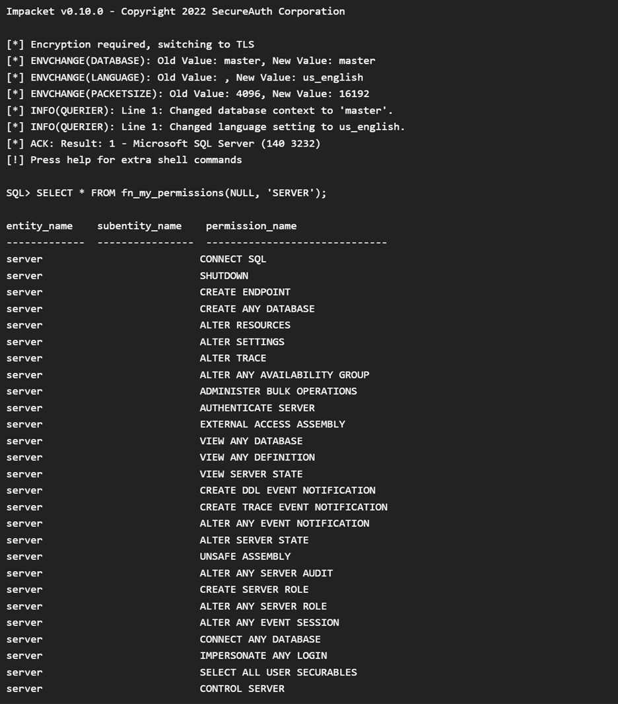

Kết quả thu được mã hash của tài khoản dịch vụ mssql-svc.
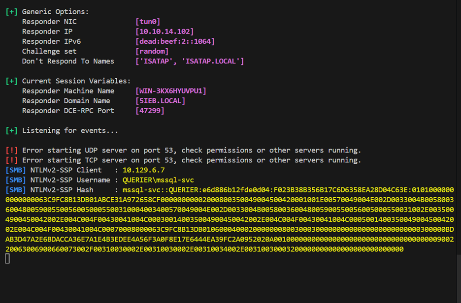

Lưu lại mã hash của tài khoản mssql-svc và sử dụng hashcat để crack. 
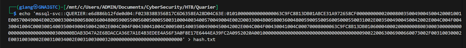

May mắn là password yếu và có trong wordlist nên hashcat đã crack thành công ngay lập tức.
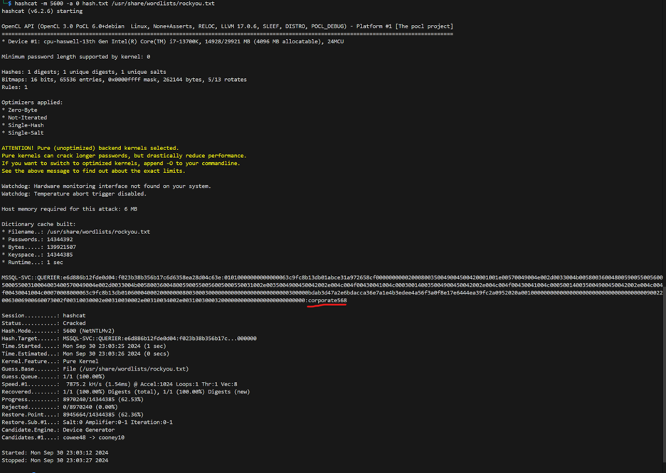

=> Ta thu được credential là mssql-svc:corporate568

Đăng nhập với tài khoản mới trên mssql server ta nhận thấy thành công leo lên 1 quyền hạn cao hơn. Sau đó thử chạy xp_cmdshell thì vẫn có thông báo là không thành công do bị block. Thử mở khóa thông qua lệnh enable_xp_cmdshell và kết quả mở khóa thành công.

Sau khi xp_cmdshell chạy thành công, bước tiếp theo là đặt reverse shell. Chúng ta sẽ tạo một SMB server chứa nc.exe và sử dụng UNC path để kéo công cụ vào server mục tiêu, từ đó thiết lập reverse shell.
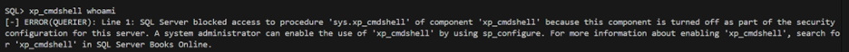

Dùng rlwrap để hứng kết nối tại port 443. 
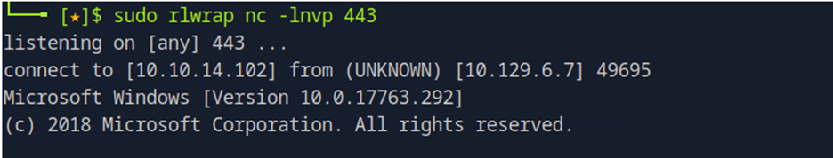

Tạo server smb, trong server này đã trang bị nc64.exe. 
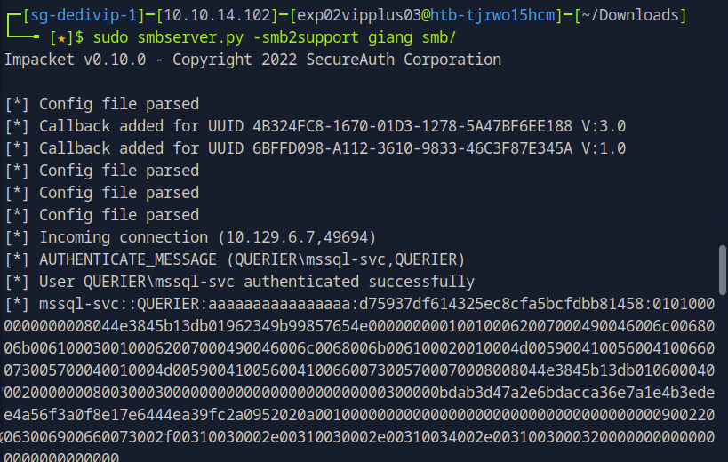

Đăng nhập vào mssql với tài khoản mssql-svc và thực hiện xp_cmdshell kết hợp với UNC path ra smb server của kali.
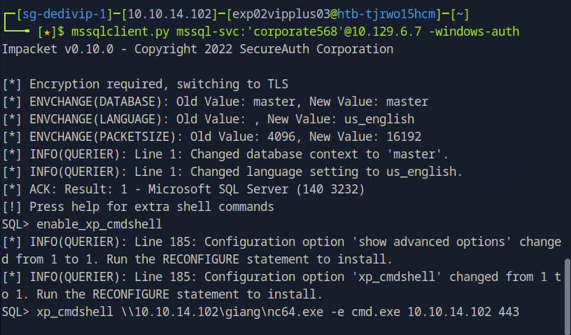

Thành công móc được kết nối reverse shell ra bên ngoài, thành công lấy được flag user.txt.
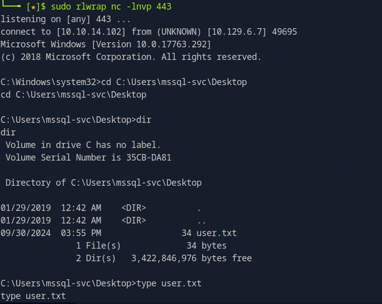

### Leo thang đặc quyền trong server windows

#### Liệt kê

Tôi sử dụng script Powerup.ps1 để tìm cách liệt kê các thông tin nhạy cảm trong windows nhằm leo quyền. Tiếp tục đẩy file PowerUp.ps1 vào smb và kéo pháo vào để tấn công mục tiêu thông qua lệnh xcopy.

Thực hiện PowerUp.ps1 tại mục tiêu ta thu được credential của tài khoản admin.
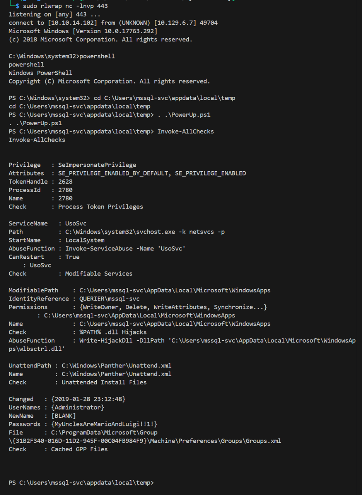

Tạo shell với quyền admin thông qua credential vừa tìm được ở bước trên. 
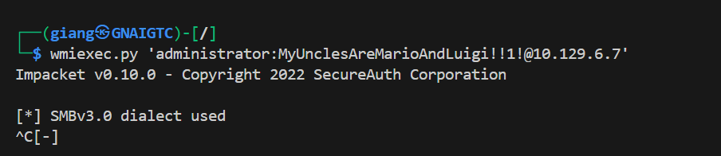

Lúc này ta đã thành công có được quyền admin, lấy flag root.txt và hoàn thành bài lab.
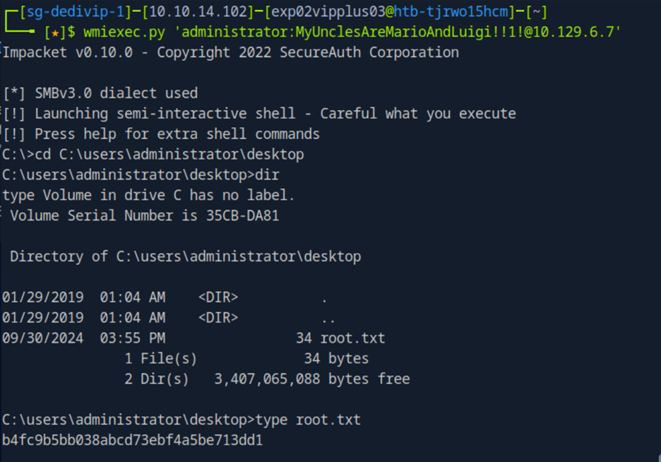


## Tổng kết - Ánh xạ MITRE ATT&CK

### Chiến thuật: Thu thập thông tin

| Kỹ thuật / Kỹ thuật phụ | Quy trình của kẻ tấn công |
|-------------------------|---------------------------|
| Active Scanning [T1595] | Kẻ tấn công đã thực hiện trinh sát target để thu thập các thông tin sơ lược như các port được mở và các service tương ứng, phiên bản. |

### Chiến thuật: Truy cập ban đầu

| Kỹ thuật / Kỹ thuật phụ | Quy trình của kẻ tấn công |
|-------------------------|---------------------------|
| Valid Accounts [T1078] | Sử dụng thông tin đăng nhập thu được từ file VBA (vbaProject.bin) trong file Excel để truy cập vào MSSQL Server. |
| Exploit Public-Facing Application [T1190] | Lợi dụng các dịch vụ mở như SMB và MSSQL để thực hiện các cuộc tấn công và khai thác. |

### Chiến thuật: Truy cập thông tin xác thực

| Kỹ thuật / Kỹ thuật phụ | Quy trình của kẻ tấn công |
|-------------------------|---------------------------|
| T1003 - OS Credential Dumping | Kẻ tấn công bắt được request xác thực NTLMv2 và có thực hiện crack hash thu được qua bruteforce. |
| T1552 - Unsecured Credentials | Từ credential thu được từ hash, kẻ tấn công thâm nhập sâu hơn vào hệ thống. |
| T1555 - Credentials from Password Stores | Kẻ tấn công tìm được mật khẩu tài khoản admin dạng bản rõ được lưu trữ. |
