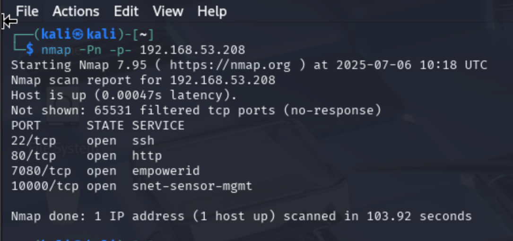

(kali?kali)-[~]$ nmap -Pn -p- 192.168.53.208    
Starting Nmap 7.95 ( https://nmap.org ) at 2025-07-06 10:18 UTC
Nmap scan report for 192.168.53.208
Host is up (0.00047s latency).
Not shown: 65531 filtered tcp ports (no-response)
PORT      STATE SERVICE
22/tcp    open  ssh
80/tcp    open  http
7080/tcp  open  empowerid
10000/tcp open  snet-sensor-mgmt

Nmap done: 1 IP address (1 host up) scanned in 103.92 seconds

Thu nmap voi option -sV -sC nhan thay ca 3 port 80, 7080,10000 deu la web
Thuc hien whatweb thu thap them thong tin:

1. whatweb http://192.168.53.208                
http://192.168.53.208 [200 OK] Bootstrap, Country[RESERVED][ZZ], Email[jfoster@offs.ec], Frame, HTML5, HTTPServer[LiteSpeed], IP[192.168.53.208], JQuery[1.12.4], LiteSpeed, Modernizr[3.6.0.min], Script, Title[Jane Foster - Personal Portfolio], X-UA-Compatible[ie=edge]

2. whatweb https://192.168.53.208:7080/login.php
https://192.168.53.208:7080/login.php [200 OK] Bootstrap, Cookies[LSUI37FE0C43B84483E0,litespeed_admin_lang], Country[RESERVED][ZZ], HTML5, HTTPServer[LiteSpeed], HttpOnly[LSUI37FE0C43B84483E0,litespeed_admin_lang], IP[192.168.53.208], JQuery[2.2.4], LiteSpeed, Meta-Author[LiteSpeed Technologies, Inc.], Object[image/svg+xml], PHP[5.6.36], PasswordField[pass], Script[text/javascript], Title[LiteSpeed WebAdmin Console], UncommonHeaders[referrer-policy,x-content-type-options,alt-svc], X-Frame-Options[SAMEORIGIN], X-Powered-By[PHP/5.6.36], X-UA-Compatible[IE=edge], X-XSS-Protection[1;mode=block]

3. curl -kIv https://192.168.53.208:10000/
*   subject: O=Webmin Webserver on ubuntu,CN=*,EMAIL=root@ubuntu

(kali?kali)-[~]$ ffuf -u http://192.168.52.208:80/FUZZ -w /usr/share/wordlists/dirb/common.txt 

        /'___\  /'___\           /'___\       
       /\ \__/ /\ \__/  __  __  /\ \__/       
       \ \ ,__\\ \ ,__\/\ \/\ \ \ \ ,__\      
        \ \ \_/ \ \ \_/\ \ \_\ \ \ \ \_/      
         \ \_\   \ \_\  \ \____/  \ \_\       
          \/_/    \/_/   \/___/    \/_/       

       v2.1.0-dev
________________________________________________

 :: Method           : GET
 :: URL              : http://192.168.52.208:80/FUZZ
 :: Wordlist         : FUZZ: /usr/share/wordlists/dirb/common.txt
 :: Follow redirects : false
 :: Calibration      : false
 :: Timeout          : 10
 :: Threads          : 40
 :: Matcher          : Response status: 200-299,301,302,307,401,403,405,500
________________________________________________

                        [Status: 200, Size: 34274, Words: 15163, Lines: 719, Duration: 13ms]
.htaccess               [Status: 403, Size: 1227, Words: 107, Lines: 15, Duration: 16ms]
assets                  [Status: 301, Size: 1260, Words: 109, Lines: 15, Duration: 6ms]
blocked                 [Status: 301, Size: 1260, Words: 109, Lines: 15, Duration: 3ms]
cgi-bin                 [Status: 301, Size: 1260, Words: 109, Lines: 15, Duration: 2ms]
docs                    [Status: 301, Size: 1260, Words: 109, Lines: 15, Duration: 2ms]
index.html              [Status: 200, Size: 34274, Words: 15163, Lines: 719, Duration: 2ms]
:: Progress: [4614/4614] :: Job [1/1] :: 0 req/sec :: Duration: [0:00:00] :: Errors: 0 ::

?$ ffuf -u https://192.168.52.208:7080/FUZZ -w /usr/share/wordlists/dirb/common.txt 

        /'___\  /'___\           /'___\       
       /\ \__/ /\ \__/  __  __  /\ \__/       
       \ \ ,__\\ \ ,__\/\ \/\ \ \ \ ,__\      
        \ \ \_/ \ \ \_/\ \ \_\ \ \ \ \_/      
         \ \_\   \ \_\  \ \____/  \ \_\       
          \/_/    \/_/   \/___/    \/_/       

       v2.1.0-dev
________________________________________________

 :: Method           : GET
 :: URL              : https://192.168.52.208:7080/FUZZ
 :: Wordlist         : FUZZ: /usr/share/wordlists/dirb/common.txt
 :: Follow redirects : false
 :: Calibration      : false
 :: Timeout          : 10
 :: Threads          : 40
 :: Matcher          : Response status: 200-299,301,302,307,401,403,405,500
________________________________________________

admin.php               [Status: 403, Size: 1227, Words: 107, Lines: 15, Duration: 2ms]
                        [Status: 302, Size: 0, Words: 1, Lines: 1, Duration: 71ms]
docs                    [Status: 301, Size: 1260, Words: 109, Lines: 15, Duration: 0ms]
favicon.ico             [Status: 200, Size: 1150, Words: 6, Lines: 3, Duration: 2ms]
info.php                [Status: 403, Size: 1227, Words: 107, Lines: 15, Duration: 3ms]
index.php               [Status: 302, Size: 0, Words: 1, Lines: 1, Duration: 5ms]
lib                     [Status: 301, Size: 1260, Words: 109, Lines: 15, Duration: 2ms]
phpinfo.php             [Status: 403, Size: 1227, Words: 107, Lines: 15, Duration: 2ms]
res                     [Status: 301, Size: 1260, Words: 109, Lines: 15, Duration: 3ms]
view                    [Status: 301, Size: 1260, Words: 109, Lines: 15, Duration: 2ms]
xmlrpc.php              [Status: 403, Size: 1227, Words: 107, Lines: 15, Duration: 25ms]
xmlrpc_server.php       [Status: 403, Size: 1227, Words: 107, Lines: 15, Duration: 26ms]
:: Progress: [4614/4614] :: Job [1/1] :: 22 req/sec :: Duration: [0:00:11] :: Errors: 0 ::
                                                                                           

