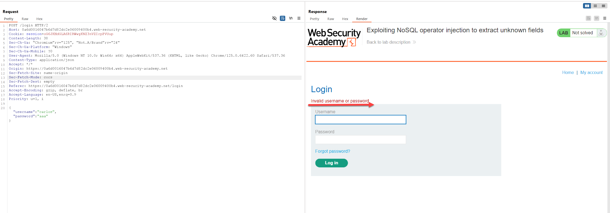
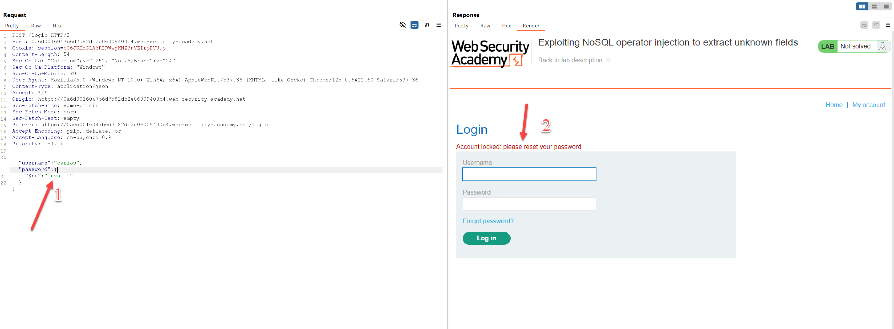
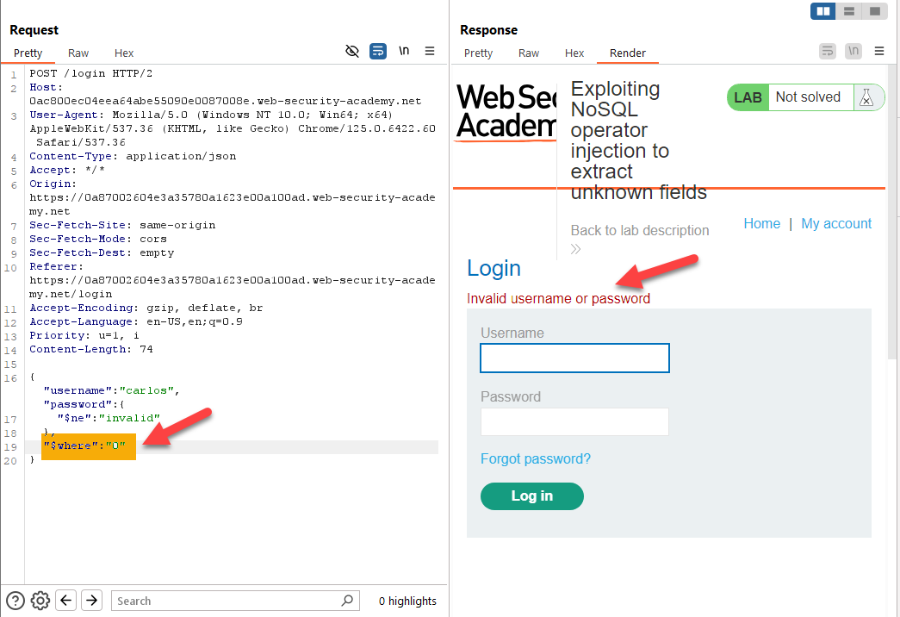
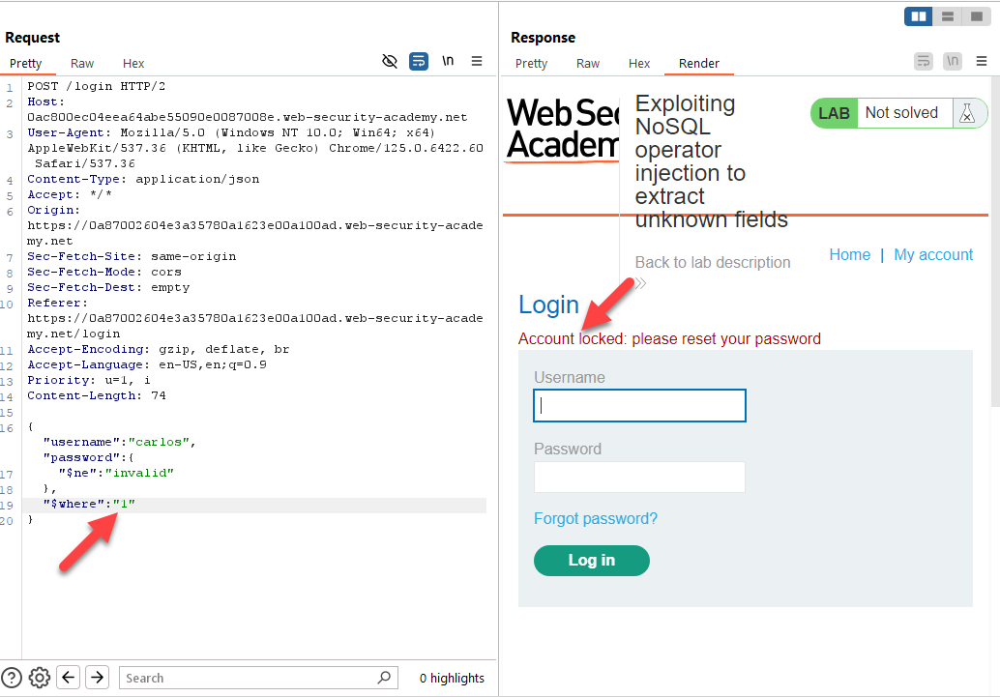
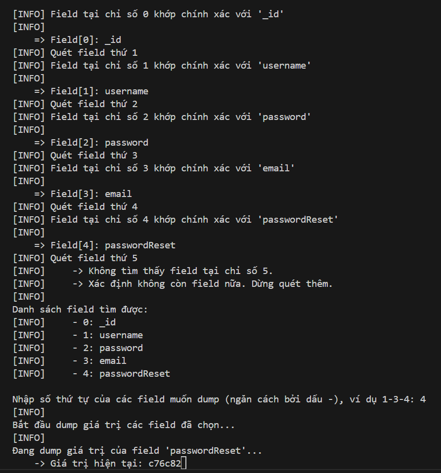

# Writeup: Exploiting NoSQL Operator Injection to Extract Unknown Fields

## Table of Contents
1. [Overview](#overview)
2. [Background](#background)
3. [Enumeration](#enumeration)
4. [Exploitation](#exploitation)

## Overview
Trong bài viết này, chúng ta sẽ khám phá quá trình khai thác lỗ hổng injection của NoSQL để trích xuất các trường không xác định từ cơ sở dữ liệu. 
Các cơ sở dữ liệu NoSQL, chẳng hạn như MongoDB, ngày càng phổ biến nhờ tính linh hoạt và khả năng mở rộng của chúng. Tuy nhiên, chúng cũng dễ bị tấn công injection nếu không được bảo mật đúng cách.  
Bài lab này cung cấp một ví dụ cụ thể về cách khai thác NoSQL operator injection để trích xuất các trường ẩn từ cơ sở dữ liệu. Để hoàn thành bài lab thì cần phải login thành công với user Carlos.

## Background
NoSQL là một loại cơ sở dữ liệu phi quan hệ được thiết kế để xử lý các tập dữ liệu lớn và không có cấu trúc. Không giống như các cơ sở dữ liệu quan hệ truyền thống, NoSQL không sử dụng các bảng và SQL để quản lý dữ liệu. Thay vào đó, nó sử dụng các mô hình dữ liệu khác nhau như tài liệu, đồ thị, cột và khóa-giá trị, mang lại sự linh hoạt và hiệu suất cao trong nhiều trường hợp sử dụng.

Cấu trúc của NoSQL thường bao gồm các tài liệu JSON hoặc BSON với các câu lệnh truy vấn đơn giản và trực quan. Ví dụ, trong MongoDB, một truy vấn có thể được viết như sau:
```json
db.collection.find({ "field": "value" })
```

NoSQL injection là kỹ thuật tấn công khi kẻ tấn công lợi dụng khả năng thao tác câu lệnh truy vấn của NoSQL để thực hiện các truy vấn trái phép hoặc thay đổi dữ liệu. Theo PortSwigger, có hai loại NoSQL injection cơ bản:

- **Syntax Injection**: Xảy ra khi bạn phá vỡ cú pháp truy vấn của NoSQL, từ đó có thể chèn payload tùy ý. Phương pháp này tương tự như SQL injection, nhưng bản chất của cuộc tấn công khác biệt do các cơ sở dữ liệu NoSQL sử dụng nhiều ngôn ngữ truy vấn, cú pháp và cấu trúc dữ liệu đa dạng.
  
- **Operator Injection**: Xảy ra khi bạn có thể lợi dụng các toán tử truy vấn của NoSQL để thao túng truy vấn, từ đó thay đổi kết quả trả về hoặc thực thi các lệnh không mong muốn.

## Enumeration
Trong quá trình quan sát trang web mục tiêu được cung cấp trong bài lab, tôi nhận thấy đây là một website bán hàng cơ bản với các chức năng chính như lọc sản phẩm theo danh mục, xem chi tiết sản phẩm và thực hiện đăng nhập kèm theo chức năng quên mật khẩu.

Tiến hành thử nghiệm một số payload với các điểm vào ứng dụng đã liệu kê nêu trên, đã xuất hiện một điểm bất ngờ ở chức năng đăng nhập: trường password cho phép chèn điều kiện như {"$ne": "invalid"}, từ đó làm thay đổi kết quả trả về. 


Có vẻ như endpoint đăng nhập này chứa lỗi NoSQL Injection. Tuy nhiên, account duy nhất mà chúng ta biết là Carlos thì đang bị khóa. Vậy bây giờ để truy cập được vào account này thì có một số giả thiết sau:
1. Bypass kiểm tra mật khẩu => không hợp lý vì tài khoản này hiện tại đang bị khóa, yêu cầu đổi mật khẩu.
2. Trích xuất thông tin nhạy cảm (password/token/token reset) => trong trường hợp này cần phải lấy được token reset.
3. Quản lý cơ chế khóa tài khoản để tiếp tục khai thác. => Nếu có thể thay đổi trạng thái của tài khoản bị khóa thì việc lấy password ở trường hợp 2 hoặc bypass đăng nhập ở trường hợp 1 sẽ khả thi.

## Exploitation
Để xác định được ta cần thực hiện theo phương pháp nào trong các giả thiết trên, ta cần phải xác định xem có các cột nào. Ở đây tôi sẽ thử sử dụng toán tử $where để thực thi javascript trên server, nếu phản hồi thay đổi dựa trên điều kiện thì tôi sẽ sử dụng kỹ thuật brute-force để đoán từng ký tự của tên các cột (các field).



Nhận thấy toán tử $where hoạt động => có thể thực hiện các đoạn JavaScript trên server để dump lấy thông tin các field.

Đoạn này vì lười nên tôi đã đi nhờ bác AI viết cho tôi 1 đoạn script python để bruteforce lấy thông tin tên của các field và sao đó cho phép chọ field cần dump giá trị (dump giá trị tương ứng với user Carlos). Chi tiết có thể xem tại file mô tả là README.MD

Lưu ý là để có reset token thì cần phải thực hiện chức năng quên mật khẩu để hệ thống tạo ra token reset.

Kết quả:


Sau khi có được token thì dùng cho chức năng resetpassword để đổi mật khẩu và đăng nhập thành công với user Carlos.

